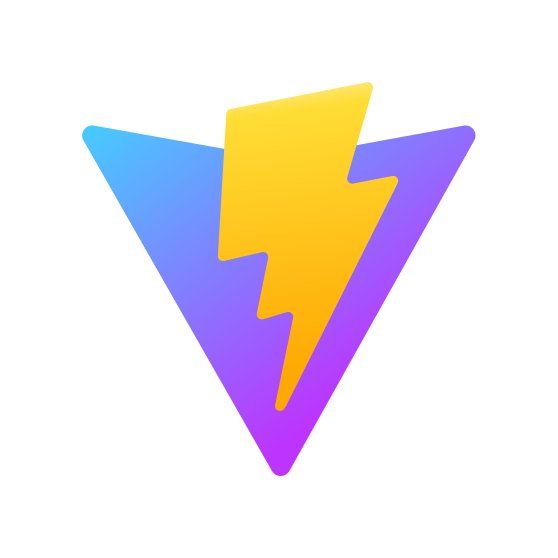
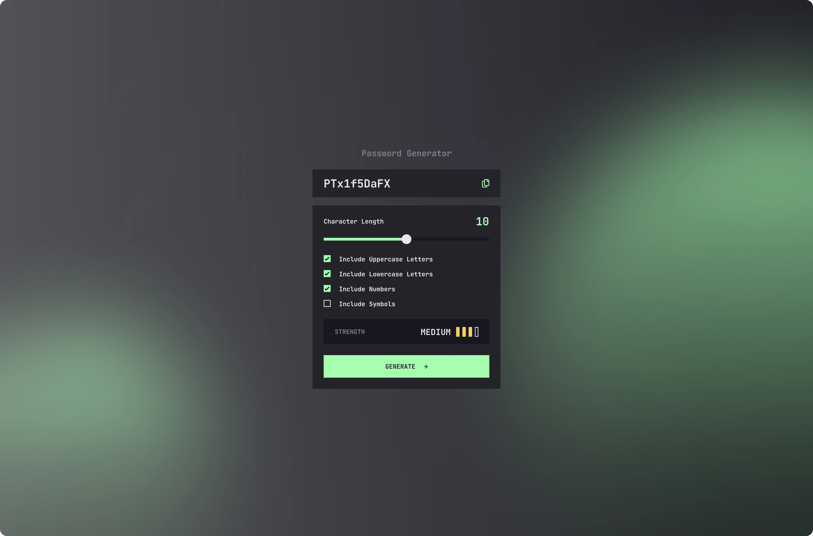

  
  
  
  
  <!--  -->
  
  
  

# Hi 👋 there!

So glad you've dropped by my coding corner. Here, it's all about web design,
coding magic.

Between coding sessions, I'm probably out cycling 🚴‍♂️ or having fun annoying my
kids (they secretly love it 😁).

Dive 👀 into my projects, see what sparks joy, and let's chat 💬 about anything
from tech to the best cycling routes.

Happy exploring!

# Project: WebApp - Password Generator

### Requirements

Build out this Password Generator app and get it looking as close to the design
as possible.

Your users should be able to:

- Generate a password based on the selected inclusion options
- Copy the generated password to the computer's clipboard
- See a strength rating for their generated password
- View the optimal layout for the interface depending on their device's screen
  size
- See hover and focus states for all interactive elements on the page

### Tech Stack:

- HTML5;
- CSS3;
- TypeScript
- React
- TailwindCSS
- Vite
- Npm

### Links

- Solution URL: [FrontendMentor Solution Hub]([👉 ADD LINK!])
- Live Site URL: [Live Preview]([👉 ADD LINK!])

## Author

- Frontend Mentor -
  [Web Development](https://www.frontendmentor.io/profile/grifano)
- LinkedIn - [Serhii Orlenko](https://www.linkedin.com/in/grifano/)
